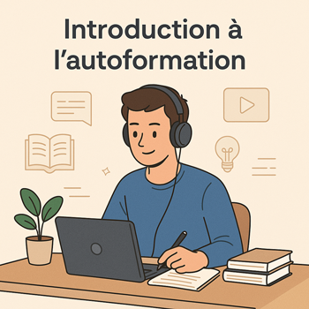

# **Autoformations Web & Mobile Solicode**

Bienvenue sur la **plateforme des autoformations Web & Mobile Solicode**.  
Elle permet aux apprenants d’avancer **en autonomie** sur un parcours structuré par **compétences (C1 → C7)**, **micro-compétences**, **UAs** et **chapitres**, en complément des sessions encadrées.

---

## 🎓 Ce que tu vas trouver ici

- Des **chapitres guidés (Niveau 1 – Imitation)** : pas-à-pas, code copiables, exercices courts.  
- Des **UAs** qui regroupent 2–3 chapitres cohérents, avec **livrable** et **grille d’évaluation**.  
- Des **autoformations** (10–20 h) centrées sur une micro-compétence, prêtes à réutiliser en session.  

---

## 🧭 La progression en 3 niveaux

- **N1 – Imitation** : j’apprends en suivant un tutoriel guidé (autoformation).  
- **N2 – Adaptation** : je réalise un **prototype** focalisé, réutilisable en mini-projet.  
- **N3 – Transposition** : je mène un **mini-projet** autonome avec livrables évaluables.

---

## 🧩 Le fil rouge de l’année

- **Web** : construction progressive d’un **Blog sous Laravel** (routes, Blade, validation, Eloquent, API…).  
- **Mobile** : **App Android (Kotlin/Compose)** consommant l’API du blog et permettant le **classement des articles** (lecture, tri/filtre/recherche, envoi de note).

---

## 🛠️ Environnement & prérequis

- **VS Code**, **Git/GitHub**, **PHP ≥ 8.2**, **Laravel 11**, **MySQL 8** (exécution locale).  
- **Android Studio** & **Kotlin** pour la partie mobile (Compose + MVVM léger).  
- Tous les exemples sont pensés pour être **exécutés en local**, avec arborescences claires et commandes fournies.

---

## 🗓️ Organisation annuelle

Le parcours se déroule sur **18 sessions de 2 semaines**. Chaque session active **N1 → N2 → N3** (autoformation → prototype → mini-projet) pour consolider les acquis du fil rouge.

---

> 🎯 **Objectif** : un **apprentissage progressif, pratique et évaluable**, menant à un **projet final autonome** présenté en soutenance.
